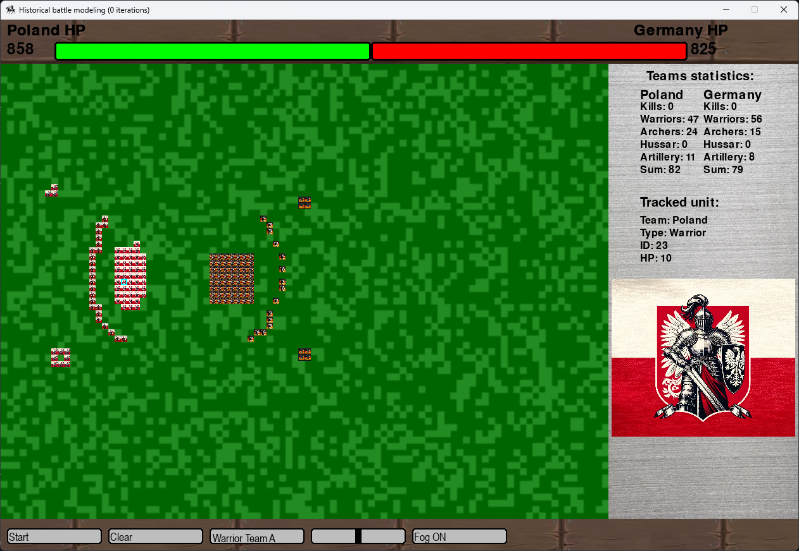

# 🏰 Symulacja historycznych bitew

## 📌 Opis projektu
Aplikacja do modelowania historycznych bitew w oparciu o wybrane zasady i mechaniki symulacyjne. Pozwala na interaktywne obserwowanie przebiegu starć oraz analizę statystyk.

## 🎮 Funkcjonalności
- 🔹 Symulacja bitew na siatce
- ⚔️ Interakcja z jednostkami
- 📊 Wyświetlanie statystyk
- 🔧 Możliwość konfiguracji parametrów
- 🏹 Różne typy jednostek (wojownicy, łucznicy, artyleria)
- 🛡 Śledzenie wybranej jednostki w czasie rzeczywistym
- 🌫 Możliwość włączenia/wyłączenia mgły wojny
- 🏳 Wizualizacja podziału drużyn i ich liczebności

## 🛠 Wymagania
- Python 3.8+
- Biblioteki (instalacja przez `pip` lub `poetry`):
  ```bash
  pip install -r requirements.txt
  ```

## 🚀 Uruchomienie
1. Pobierz lub sklonuj repozytorium:
   ```bash
   git clone https://github.com/olobuszolo/Historical-battle-modeling.git
   ```
2. Przejdź do katalogu projektu:
   ```bash
   cd Historical-battle-modeling
   ```
3. Uruchom aplikację:
   ```bash
   python main.py
   ```

## 🖼 Zrzut ekranu


## 👨‍💻 Autorzy
Projekt powstał jako praca zespołowa realizowana na przedmiocie **Modelowanie Systemów Dyskretnych**.

